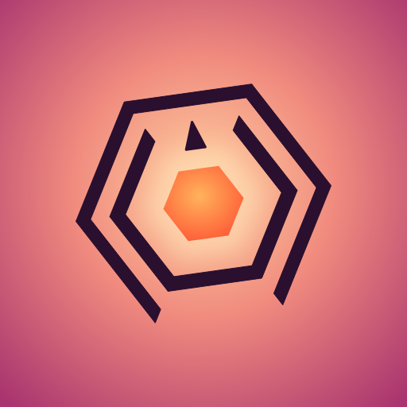

  

<h1 align="center">Duskward</h1>

<b>Outlast the day.</b> Orbit the sun, slip through the gaps and survive from dawn to midnight.

  <a href="https://atum-cell.github.io/duskward/"><b>▶ Play now</b></a>

---

## About

Duskward is a fast, one-touch survival game. You orbit a glowing sun while walls close in from every side. Find the gap, slip through, and keep going for as long as you can. Your score is how long you survive.

The sky is your clock. Every run starts at dawn and moves through morning, noon, dusk and night to midnight. As the day goes on, the spin gets faster, the music builds and the walls get trickier.

## How to play

| | Phone | Keyboard |
|---|---|---|
| Orbit left / right | Hold the left or right side of the screen | ← → or A / D |
| Start / continue | Tap | Space |
| Pause | Pause button (top) | P or Esc |
| Leaderboard / How to play / Settings | Menu buttons | L / H / S |

## Features

- **Six times of day:** each with its own sky, music and spin speed.
- **Shield charge:** brush past the edge of a wall to fill your shield ring. A full ring saves you from one hit.
- **Solar flares:** walls burst outwards from the sun. A dashed outline warns you where the gap will be.
- **Shape-shifting sun:** the sun becomes a pentagon or a square, and the walls change with it.
- **Three difficulties:** Easy, Normal and Hard, each with its own best times.
- **Online leaderboard:** pick a name and compete with everyone else who plays.
- **End-of-run stats:** near misses, shields used, flares survived and the time of day you reached.
- **Original soundtrack:** a layered piece that builds from soft pads at dawn to a full beat at midnight.
- **Built for everyone:** first-time tips, a how-to-play guide, and settings for music, sound, vibration and reduced flashing.

## Play it like an app

Open the link on your phone, then:

- **iPhone:** in Safari, tap **Share → Add to Home Screen**.
- **Android:** in Chrome, tap **⋮ → Add to Home screen** (or **Install app**).

Duskward then gets its own icon and opens full-screen.

## Privacy

Duskward has no accounts and no ads. Your settings and best times stay on your device. If you choose to add a name, that name and your best times are shown publicly on the leaderboard, so please don't use your full real name. Names can be reported from the leaderboard and offensive ones are removed.

## Built with

A single HTML file: canvas graphics, Web Audio for the music and sound effects, and [Supabase](https://supabase.com) for the leaderboard. No frameworks and no build step.

---

© 2026 Atum-cell. All rights reserved. The game, artwork, music and code are original works and may not be copied or redistributed without permission.
